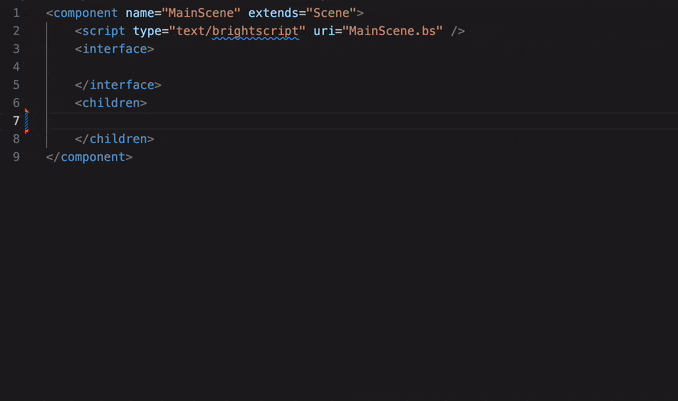

# brighterscript-xml-plugin
## BrighterScript plugin for SceneGraph XML completions

### It Does:
- suggest components
- suggest component fields

### It Does Not:
- validate field values
- suggest interface elements like `field` and `function`

### Installation
```
npm i bsc-xml
```
`bsconfig.json`
```
{
    ...
    plugins: [
        'bsc-xml'
    ]
}
```

### Usage
SceneGraph Component completions



- provides both built-in Roku SceneGraph components and custom project components
- provides built-in fields and custom fields
- auto suggestions for fields when typing inside an element tag
- use completions shortcut to trigger manually
- component completions on `<` do not fill automatically, pretty sure this is something that needs to be configured at the vscode extension level.