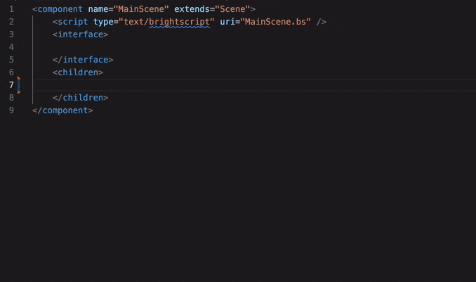

# brighterscript-xml-plugin

## BrighterScript plugin for SceneGraph XML completions

### It Does:

- suggest components
- suggest component fields
- validate field values
- validate field names
- validate child components

### It Does Not:

- suggest interface elements like `field` and `function`

### Installation

```
npm i brighterscript-xml-plugin
```

`bsconfig.json`

```
{
    ...
    plugins: [
        'brighterscript-xml-plugin'
    ]
}
```

### Usage

SceneGraph Component completions


- validates children components
- provides both built-in Roku SceneGraph components and custom project components
- provides built-in fields and custom fields
- auto suggestions for fields when typing inside an element tag
- use completions shortcut to trigger manually
- component completions on `<` do not fill automatically, pretty sure this is something that needs to be configured at the vscode extension level.
